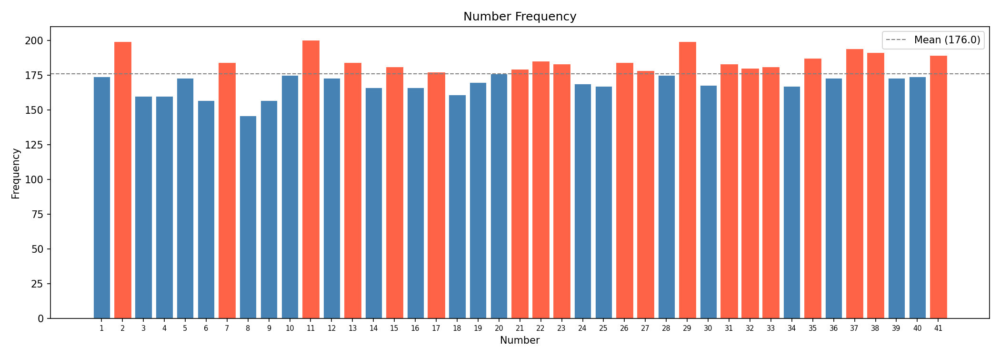

# NumberAnalysis

A statistical analysis tool for lottery draw history. Reads past draws from an Excel file and produces descriptive metrics across multiple output sheets.

> **Note:** This tool describes past patterns only. Lottery draws are independent events — no historical analysis can predict future results. See [Why prediction is not possible](#why-prediction-is-not-possible).

## Requirements

- Python 3.14+
- pandas
- openpyxl

```bash
pip install pandas openpyxl
```

## Usage

1. Place your draw history in `assets/numbers.xlsx`. Each row is one draw; the file must contain at least six numeric columns (or columns named `A`–`F`).
2. Run the script from the project root:

```bash
python main.py
```

Results are written to `assets/results.xlsx` and a frequency chart is saved to `assets/frecuencia_numeros.png`.

## Frequency chart



> Bars in red exceed the mean frequency (dashed line). Generated automatically on each run. More than 1000 samples.

## Configuration

Edit the constants at the top of `main.py`:

| Constant      | Default               | Description                                              |
|---------------|-----------------------|----------------------------------------------------------|
| `INPUT_XLSX`  | `assets/numbers.xlsx` | Input file path                                          |
| `OUTPUT_XLSX` | `assets/results.xlsx` | Output file path                                         |
| `RANGE_MIN`   | `1`                   | Minimum valid number (inclusive)                         |
| `RANGE_MAX`   | `42`                  | Maximum valid number (exclusive — current range is 1–41) |
| `K_TOP`       | `20`                  | Rows to include in Top-K sheets                          |
| `N_RECENT`    | `20`                  | Draws counted as "recent" for hot/cold analysis          |

## Output sheets

| Sheet                   | Content                                                                                      |
|-------------------------|----------------------------------------------------------------------------------------------|
| `Frecuencia_números`    | Per-number frequency across all draws                                                        |
| `Top_pares`             | Top-K most common 2-number pairs                                                             |
| `Top_trios`             | Top-K most common 3-number combinations                                                      |
| `Top_cuartetos`         | Top-K most common 4-number combinations                                                      |
| `Top_consecutivos`      | Top-K consecutive pairs (k, k+1)                                                             |
| `Top_corridas`          | Top-K consecutive runs (e.g. 5-6-7)                                                          |
| `Métricas_por_fila`     | Per-draw stats: sum, min/max, range, even/odd count, run length, deltas, decade distribution |
| `Frecuencia_posicional` | How often each number appears in each sorted position (1–6)                                  |
| `Caliente_Frio`         | All-time vs. last `N_RECENT` draws frequency per number                                      |
| `Envejecimiento`        | Draws since each number last appeared                                                        |
| `Distribución_suma`     | Histogram of draw sums                                                                       |
| `Matriz_afinidad`       | 41×41 co-occurrence matrix for every number pair                                             |
| `Filas_invalidas`       | Rows rejected during validation, with reasons                                                |

## Data validation

Each row is checked for:
- Exactly six values
- All values are integers
- All values are within `[RANGE_MIN, RANGE_MAX)`
- No duplicate values within the row

Invalid rows are excluded from all analysis and collected in the `Filas_invalidas` sheet.

## Why prediction is not possible

Each lottery draw is an independent random event. A number that has appeared frequently in the past has the same probability of appearing in the next draw as one that has never appeared — historical frequency carries no predictive signal.

The metrics in this tool are useful for **auditing draw fairness** (a statistically biased draw would show a non-uniform frequency distribution) but not for forecasting outcomes. The most rational play strategy is a uniformly random selection ("quick pick"), which also avoids prize-splitting with other players who choose popular number combinations.
